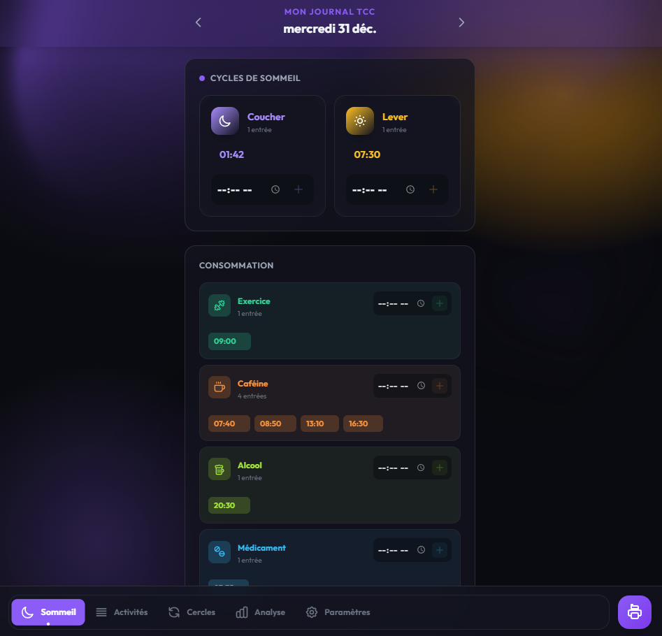
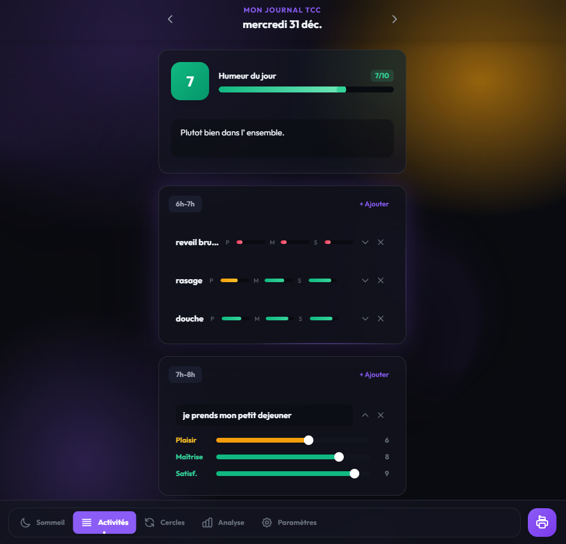
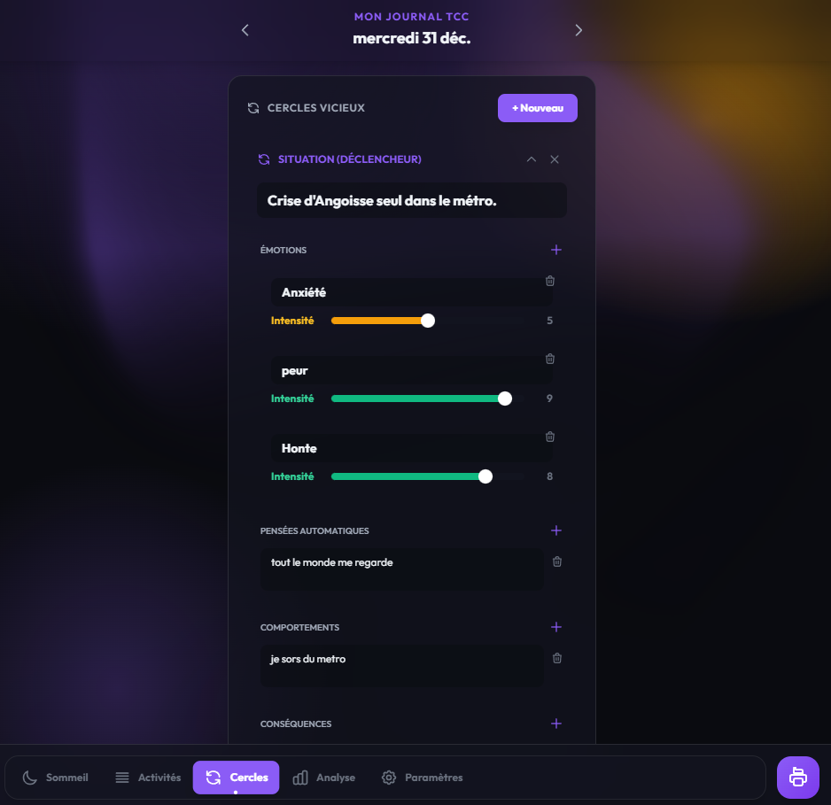

# Moodix - Journal TCC auto-hébergé


Application web bilingue (FR/EN) de journal numérique pour la Thérapie Cognitive Comportementale. Conçue pour être auto-hébergée par un patient ou un praticien.

[Read in English](README.md)

> **Avertissement médical.** Ce n'est pas un outil médical. C'est un carnet numérique destiné à aider un patient à suivre pensées, émotions et comportements dans le cadre d'un suivi TCC sous supervision professionnelle. Aucune analyse clinique automatisée n'est produite.



## Pourquoi ce projet

Les outils TCC commerciaux centralisent des données très sensibles chez des tiers. Moodix se déploie sur sa propre infra (VPS, homelab, Raspberry Pi). Les données restent chez l'utilisateur, dans une SQLite locale.

## Ce qui le rend particulier

- **Données souveraines** : tout vit dans une SQLite locale, sur ton infra. Aucun appel sortant, aucune télémétrie, pas de SaaS au milieu.
- **Auto-save tolérant aux coupures réseau** : les écritures sont mises en file dans `localStorage` quand le réseau est down, rejouées au retour en ligne. Tu ne perds pas une saisie même si le tunnel VPN tombe pendant que le patient remplit son carnet.
- **Multi-utilisateurs sans complexité d'auth** : un rôle admin distinct, bcrypt, rate limit Flask-Limiter, protection CSRF via vérification d'`Origin`. Pas de SSO, pas d'OAuth.
- **Modèle TCC complet** : pas juste un mood tracker. Suivi quotidien (sommeil, activités horaires avec scores plaisir/maîtrise/satisfaction, consommables), cercles vicieux structurés, et statistiques hebdomadaires agrégées.

## Fonctionnalités

### Suivi quotidien

- **Sommeil** : cycles avec historique visuel.
- **Activités** : journal par plage horaire (6h à 2h le lendemain) avec scores plaisir / maîtrise / satisfaction.
- **Humeur** : évaluation quotidienne (0 à 10).
- **Consommables** : tracking configurable (exercice, caféine, médicaments, custom).



### Cercles vicieux (cycles TCC)

Analyse structurée des pensées automatiques : situation, émotions, pensées, comportements, conséquences.



### Analyse

- Statistiques hebdomadaires : moyenne humeur, moyenne sommeil, total activités, jours complétés.
- Top activités classées par score de plaisir moyen.

### Interface

- Mode sombre et clair.
- 5 thèmes de couleurs (violet, bleu, vert, rose, orange).
- Mobile-first responsive.
- Bilingue FR/EN (détection auto via `navigator.language`).

### Robustesse

- Auto-save tolérant aux coupures réseau : les écritures sont mises en file dans `localStorage`, rejouées au retour en ligne.
- Multi-utilisateurs avec rôle admin distinct.
- Export PDF de toutes les entrées (via `reportlab`).
- Export JSON pour la portabilité des données.

## Démarrage rapide

Prérequis : Python 3.8+ et Node.js 18+.

```bash
git clone https://github.com/breaching/moodix.git
cd moodix

# Dépendances backend
pip install -r backend/requirements.txt

# Dépendances frontend + build (Flask sert le dist/ généré)
npm install && npm run build

# Démarrer le serveur (sert le frontend buildé + l'API sur le port 5000)
python backend/serv.py
```

Ou utiliser le launcher tout-en-un qui gère venv + deps + build + start :

```bash
./start.sh         # Linux / macOS
start.bat          # Windows
```

Application sur `http://localhost:5000`.

Identifiants par défaut : `admin` / `admin`. À changer immédiatement.

## Configuration

### Changer le mot de passe admin

```bash
python backend/hash_password.py VotreMotDePasseFort
# Copier le hash dans .env (APP_PASSWORD_HASH)
```

### Variables d'environnement

```env
FLASK_ENV=production
APP_USERNAME=votre_username
APP_PASSWORD_HASH=<hash_genere>
SECRET_KEY=<aleatoire_64_chars>
```

Générer une `SECRET_KEY` :
```bash
python -c "import secrets; print(secrets.token_hex(32))"
```

## Sécurité

Implémenté côté code :

- Hash bcrypt des mots de passe.
- Rate limiting sur le login (`Flask-Limiter`).
- Sanitization des entrées (`bleach`).
- Protection CSRF via vérification d'`Origin`.
- Cookies de session : HTTPOnly + SameSite=Lax, flag Secure auto-activé en production via `FLASK_ENV=production`.
- ORM SQLAlchemy contre l'injection SQL.

À configurer côté admin :

- TLS via Let's Encrypt et reverse proxy.
- Firewall.
- Sauvegardes régulières de la SQLite.

## Déploiement production

Serveur WSGI (à lancer depuis la racine du projet pour que les chemins relatifs résolvent) :

```bash
# Linux / Mac
gunicorn -w 4 -b 0.0.0.0:5000 --chdir . backend.serv:app

# Windows
waitress-serve --port=5000 backend.serv:app
```

Reverse proxy Nginx :

```nginx
server {
    listen 443 ssl http2;
    server_name votre-domaine.com;

    ssl_certificate /etc/letsencrypt/live/votre-domaine.com/fullchain.pem;
    ssl_certificate_key /etc/letsencrypt/live/votre-domaine.com/privkey.pem;

    location / {
        proxy_pass http://127.0.0.1:5000;
        proxy_set_header Host $host;
        proxy_set_header X-Real-IP $remote_addr;
        proxy_set_header X-Forwarded-For $proxy_add_x_forwarded_for;
        proxy_set_header X-Forwarded-Proto $scheme;
    }
}
```

## Stack technique

- **Backend** : Flask 3, SQLAlchemy, bcrypt, Flask-Limiter, bleach, reportlab.
- **Frontend** : React 18, TypeScript, Tailwind CSS, Zustand, Vite.
- **Base de données** : SQLite.

## Statut du projet

Projet personnel, maintenu de manière irrégulière. Issues et PR bienvenues, sans SLA sur les réponses. Pour un usage clinique sérieux, vérifier la conformité réglementaire applicable (RGPD, hébergement de données de santé en France).

## Licence

MIT, voir [LICENSE](LICENSE).
