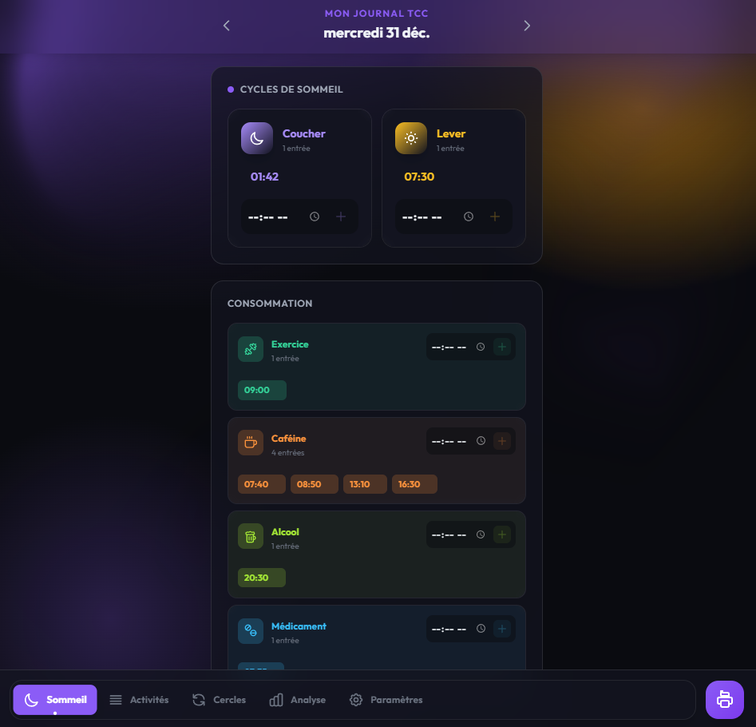
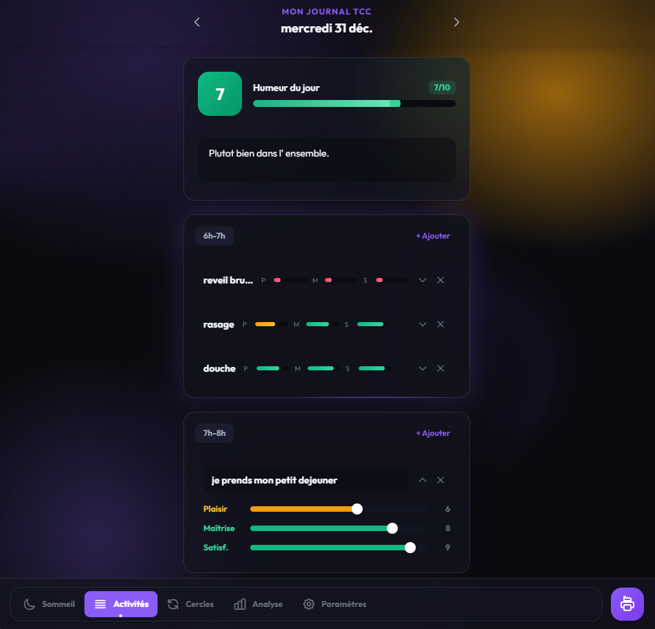

# Moodix - Journal TCC Auto-hébergé

Application web de **journal numérique** pour la Thérapie Cognitive Comportementale (TCC).

> **Avertissement Médical**
>
> Cette application n'est **PAS un outil médical**. Elle sert uniquement de **carnet numérique** pour aider les patients à suivre leurs pensées, émotions et comportements dans le cadre d'un programme TCC **sous supervision professionnelle**.

[Read in English](README.en.md)



## Fonctionnalités

### Suivi Quotidien
- **Sommeil** : Cycles de sommeil avec historique visuel.
- **Activités** : Journal par plage horaire avec scores plaisir/maîtrise/satisfaction.
- **Humeur** : Évaluation quotidienne (0-10).
- **Consommables** : Tracking personnalisable (exercice, caféine, médicaments...).



### Cercles Vicieux (Cycles TCC)
- Analyse structurée des pensées automatiques.
- Documentation : situations, émotions, pensées, comportements, conséquences.


### Analyse & Statistiques
- Graphiques d'évolution (sommeil, humeur).
- Top activités par score de plaisir.
- Statistiques hebdomadaires.

### Interface
- Mode sombre/clair.
- 5 thèmes de couleurs.
- Design responsive mobile-first.
- Animations fluides.

### Fonctionnalités Avancées
- Notifications navigateur programmables.
- Auto-sauvegarde temps réel + mode hors ligne.
- Export PDF personnalisable.
- Import/Export JSON.
- Multi-utilisateurs avec gestion admin.

## Démarrage Rapide

### Prérequis
- Python 3.8+
- Node.js 18+ (pour le build frontend)

### Installation

```bash
# 1. Cloner le repository
git clone https://github.com/breaching/moodix.git
cd moodix

# 2. Installer les dépendances Backend
pip install -r requirements.txt

# 3. Installer les dépendances Frontend (optionnel, le dossier `dist/` est déjà pré-compilé)
npm install
npm run build

# 4. Lancer le serveur
python serv.py
```

L'application est maintenant accessible à l'adresse `http://localhost:5000`.

**Identifiants par défaut** : `admin` / `admin`

**IMPORTANT : Changez le mot de passe immédiatement !**

## Configuration

### Changer le mot de passe

Pour modifier le mot de passe, exécutez le script `hash_password.py` et copiez le hash généré dans votre fichier `.env`.

```bash
python hash_password.py VotreMotDePasseFort
# Copiez le hash obtenu
```

### Variables d'environnement

Créez un fichier `.env` à la racine du projet (vous pouvez copier/coller depuis `.env.example`).

```env
FLASK_ENV=production
APP_USERNAME=votre_username
APP_PASSWORD_HASH=<collez_le_hash_genere_ici>
SECRET_KEY=<cle_aleatoire_de_64_caracteres>
```

Pour générer une `SECRET_KEY` sécurisée :
```bash
python -c "import secrets; print(secrets.token_hex(32))"
```

## Structure du Projet

```
moodix/
├── src/                    # Code source React/TypeScript
│   ├── components/         # Composants React
│   ├── stores/             # Stores Zustand
│   ├── api/                # Client API
│   └── utils/              # Utilitaires
├── dist/                   # Build frontend (généré)
├── serv.py                 # Serveur Flask
├── requirements.txt        # Dépendances Python
├── package.json            # Dépendances Node.js
├── .env.example            # Template de configuration
├── hash_password.py        # Générateur de hash
├── start.bat               # Script de démarrage Windows
└── start.sh                # Script de démarrage Linux/Mac
```

## Technologies Utilisées

- **Backend** : Flask, SQLAlchemy, bcrypt
- **Frontend** : React 18, TypeScript, Tailwind CSS, Zustand
- **Base de données** : SQLite
- **Outil de build** : Vite

## Déploiement en Production

Il est recommandé d'utiliser un serveur WSGI approprié comme Gunicorn ou Waitress.

### Serveur WSGI

**Linux/Mac (Gunicorn)** :
```bash
pip install gunicorn
gunicorn -w 4 -b 0.0.0.0:5000 serv:app
```

**Windows (Waitress)** :
```bash
pip install waitress
waitress-serve --port=5000 serv:app
```

### Reverse Proxy (Exemple avec Nginx)

L'utilisation d'un reverse proxy comme Nginx est conseillée pour gérer le HTTPS, servir les fichiers statiques et ajouter une couche de sécurité.

```nginx
server {
    listen 443 ssl http2;
    server_name votre-domaine.com;

    # Configuration SSL (ex: avec Let's Encrypt)
    ssl_certificate /etc/letsencrypt/live/votre-domaine.com/fullchain.pem;
    ssl_certificate_key /etc/letsencrypt/live/votre-domaine.com/privkey.pem;

    location / {
        proxy_pass http://127.0.0.1:5000;
        proxy_set_header Host $host;
        proxy_set_header X-Real-IP $remote_addr;
        proxy_set_header X-Forwarded-For $proxy_add_x_forwarded_for;
        proxy_set_header X-Forwarded-Proto $scheme;
    }
}
```

## Sécurité

**Fonctionnalités implémentées** :
- Limitation de tentatives de connexion (rate limiting)
- Validation des entrées
- Protection CSRF
- Cookies de session sécurisés
- Protection contre l'injection SQL (via l'ORM)
- Hachage des mots de passe (bcrypt)

**À configurer par l'administrateur** :
- HTTPS/SSL (ex: via Let's Encrypt)
- Règles de pare-feu
- Sauvegardes automatisées

## Licence

Ce projet est sous licence MIT. Consultez le fichier `LICENSE` pour plus de détails.